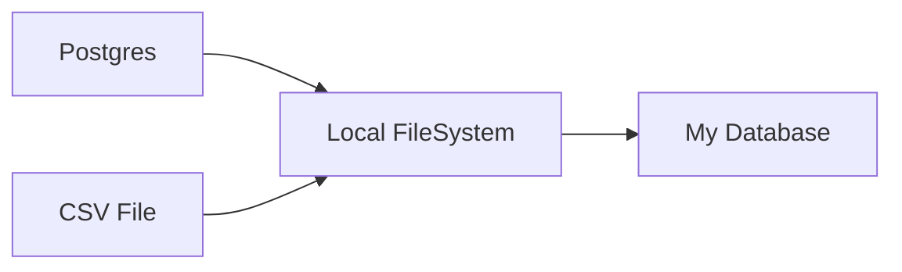



# code-challenge
*Written by Aluizio Cidral Júnior*

Resolution of Indicium Code challenge for Software Developer 

## The Challenge Synopsis

Build a pipeline that extracts the data everyday from two sources and write the data first to local disk, and second to a database. 


More info about the challenge can be found at: https://github.com/techindicium/code-challenge

## Solution

To achieve the challenge goal I decided to work with [Airflow](airflow.apache.org/), which is a tool to describing, executing and monitoring workflows. 

Airflow works with DAG (Directed Acyclic Graph) to group  and organize tasks.

### Tasks
For this pipeline there are three main tasks:
1. Extract data from Postgres database and write to local disk
2. Extract data from CSV file and write to local disk
3. Extract data from local filesystem, transform and load to final database

Every task was write as a Python script:

**Task1:** Connects to Postgress Database, gets the names of all tables and write the data in the local file with path for each source, table and execution day. 
```python
import  psycopg2
import  pandas  as  pd
import  os
import  sys

date = sys.argv[1][:10]

#PostgreSQL Connection
host = "postgres-container-indicium"
database = "northwind"
user = "northwind_user"
password = "thewindisblowing"
  
db_conn = psycopg2.connect(host=host,database = database, user = user, password = password)
db_cursor = db_conn.cursor()

def  get_table_names(db_cursor):
	table_names = []
	db_cursor.execute("""SELECT table_name FROM information_schema.tables
	WHERE table_schema = 'public'""")
	for  name  in  db_cursor.fetchall():
		table_names.append(name[0])
	return  table_names
 
def  csv_export(db_cursor,table_name,date):
	select = """SELECT * FROM {0}""".format(table_name)
	SQL_for_file_output = "COPY ({0}) TO STDOUT WITH CSV HEADER".format(select)
	path_file = "/data/postgres/{0}/{1}/data.csv".format(table_name,date)
	os.makedirs(os.path.dirname(path_file), exist_ok = True)
	with  open(path_file, 'w') as  f_output:
		db_cursor.copy_expert(SQL_for_file_output, f_output)

for  table_name  in  get_table_names(db_cursor):
	csv_export(db_cursor,table_name,date)
``` 
**Task 2:** Copies the csv file and write in the local file with path for each source, table and execution day. 
```python
import  shutil
import  os
import  sys

date = sys.argv[1][:10]

input_file = "/data/order_details.csv"
output = "/data/csv/{0}/data.csv".format(date)
os.makedirs(os.path.dirname(output), exist_ok = True)
shutil.copy(input_file,output)
```
**Task 3:** Extracts local data, joins tables and saves as json in Mongo database. I choose the json format because it's possible to list products of same order in the same json. Make things easy for a Front End Developer if hes wants to show the order details with the list of products inside.
```python
import  collections
from  numpy  import  product
import  pandas  as  pd
from  pymongo  import  MongoClient
import  sys

date = sys.argv[1][:10]

#Extract local data
orders = pd.read_csv("/data/postgres/orders/{0}/data.csv".format(date))
products = pd.read_csv("/data/postgres/products/{0}/data.csv".format(date))
customers = pd.read_csv("/data/postgres/customers/{0}/data.csv".format(date))
order_details = pd.read_csv("/data/csv/{0}/data.csv".format(date))

#Transform
orders = orders[['order_id','order_date','customer_id']].set_index('order_id')
products = products[['product_id','product_name']].set_index('product_id')
customers = customers[['customer_id','company_name']].set_index('customer_id')
orders = orders.join(customers, on = 'customer_id')
order_details = order_details.join(products, on = 'product_id')

data = []
for  order_id  in  order_details.order_id.unique():
	json = order_details[order_details.order_id == order_id].drop("order_id", axis = 1).to_dict("records")
	order = {
		"order_id": order_id,
		"order_date": orders.loc[order_id]['order_date'],
		"company_name": orders.loc[order_id]['company_name'],
		"products": json_order,
		"db_execution_date": date
		}
	data.append(order)

details = pd.DataFrame(data).to_dict("records")

# Load to Database
client = MongoClient('mongo-container', 27017, username='dharma', password = '4815162342')
db = client['orders']
collection = db['details']
collection.insert_many(details)
```
Output sample in Mongo database:

```json
{
	"_id" : ObjectId("601b4a5a5d3951efca454d16"),
	"order_id" : 10267,
	"order_date" : "1996-07-29",
	"company_name" : "Frankenversand",
	"products" : [
		{
			"product_id" : 40,
			"unit_price" : 14.7,
			"quantity" : 50,
			"discount" : 0,
			"product_name" : "Boston Crab Meat"
		},
		{
			"product_id" : 59,
			"unit_price" : 44,
			"quantity" : 70,
			"discount" : 0.15,
			"product_name" : "Raclette Courdavault"
		},
		{
			"product_id" : 76,
			"unit_price" : 14.4,
			"quantity" : 15,
			"discount" : 0.15,
			"product_name" : "Lakkalikööri"
		}
	],
	"db_execution_date" : "2015-01-01"
}
```


### DAG
One of requirements is that Task 3 depends on Task 1 and Task 2, so tasks 1 and 2 has to run successfully before task 3 can run. To deal with these dependencies Airflow needs a DAG file. The last line in the next code imposes these dependencies. 
This DAG is schedule to run at intervals of one day.

DAG File

```python
from  airflow  import  DAG
from  datetime  import  datetime, timedelta
from  airflow.operators.bash_operator  import  BashOperator
from  airflow.utils.dates  import  days_ago

default_args = {
'owner': 'Aluizio Cidral Júnior',
'depends_on_past': False,
'start_date': days_ago(2),
'retries': 1,
}

with  DAG(
'DAG',
schedule_interval=timedelta(days=1),
default_args=default_args
) as  dag:

	t1 = BashOperator(
	task_id='task1',
	bash_command="""
	cd $AIRFLOW_HOME/dags/tasks/
	python3 task1.py {{ execution_date }}
	""")
	t2 = BashOperator(
	task_id='task2',
	bash_command="""
	cd $AIRFLOW_HOME/dags/tasks/
	python3 task2.py {{ execution_date }}
	""")

	t3 = BashOperator(
	task_id='task3',
	bash_command="""
	cd $AIRFLOW_HOME/dags/tasks/
	python3 task3.py {{ execution_date }}
	""")

[t1,t2] >> t3
```
## Setup of the Solution

I used Docker to containerize  my solution. The source code can be set up using docker compose. You can install following the instructions at [https://docs.docker.com/compose/install/](https://docs.docker.com/compose/install/)
With docker compose installed simply run:

```
docker-compose up
```
## Testing the Pipeline

After you set up my code, it is possible to test each task or the whole pipeline in the past.
Access the Airflow container:
```
docker exec -it airflow-container bash
```
To test some task:

```
airflow test DAG-indicium task1 2020-01-01
```
Tasks available in DAG-indicium: task1, task2, task3. 

To run the pipeline in past days:
```
airflow backfill DAG-indicium -s 2020-01-01 -e 2020-01-08
```
The output files will be load at `/data` folder.

## Access Mongo Database

To access the Mongo Database (and see the outputs of task3), in terminal:
```
mongo -u dharma -p 4815162342 --authenticationDatabase "admin"
```
On mongo terminal:
```
> use orders
> db.details.find().pretty()
```


## Monitor and Troubleshoot 

Airflow provides a web service to monitor and troubleshoot in pipelines. To start the web server:
```
airflow webserver -p 8080
```
And Access by address [localhost:8080](https://localhost:8080). 
It is possible to verify if the pipeline failed there.

Thanks for reading! 

Aluizio Cidral Júnior
[https://www.linkedin.com/in/cidraljunior/](https://www.linkedin.com/in/cidraljunior/)
[https://github.com/cidraljunior/](https://github.com/cidraljunior/)

> Written with [StackEdit](https://stackedit.io/).
